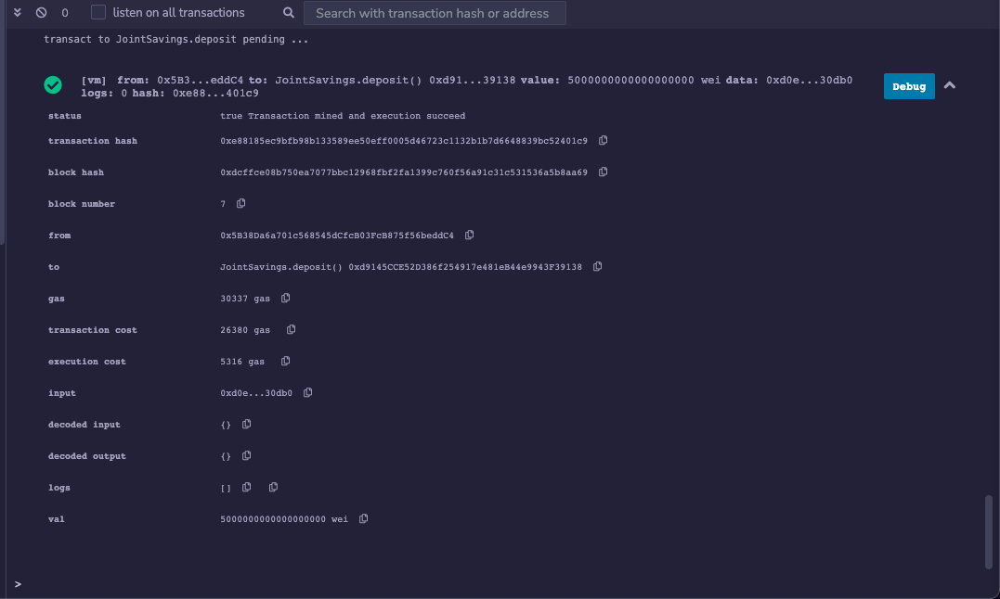

# Smart Contracts : "Joint Savings Account"

The aim of this project is to build a smart contract on the Ethereum blockchain to host joint savings account.
| |

## About 
Smart Contracts on the Ethereum network allows the automation of many common financial processes and features. The automation of such features on the blockchain means that it recieves all the benefits of blockchain technology, such as being able to verify the integrity of every transaction. Solidity is used to create the smart contract that will automate the joint savings accounts. Each account will have two addresses, one for each user, and the ability to deposit and withdraw funds from the account.

## Getting Started

To run the application, you need to use an Ethereum IDE such as [Remix](https://remix.ethereum.org/)

## Usage 
You can clone or download this GitHub project and open the `joint_savings.sol` using any IDE of your choice, one being Remix.

Ensure that the compiler is using solidity version 0.8.0.

Deploy the contract using any JavaScript VM and interact with the Deployed Smart Contract.

### Result

> Below image shows successful implementation of 'SetAccount' function to define the authorized Ethereum address

| |

> Successfull deposit of 1,5 & 10 Ethers (as wei) into the recepient's account

| |
|:--:|

| |
|:--:|

| |
|:--:|

| |
|:--:|

| |
|:--:|

Contributor
Harshita Panchal
